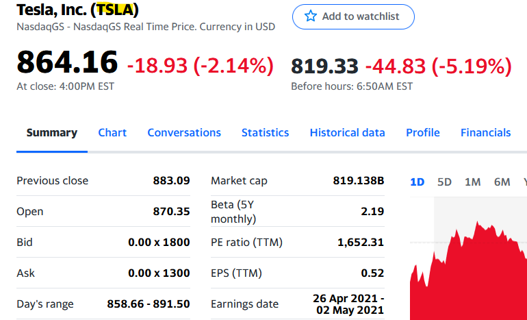

# Crawler

Trading Prediction and *Bot (Bot in development)*.
The program will be able to predict any kind of stock or REITS based on the Yahoo finance code.

This project is a personal side project however it is open for open source use and also any recommendations to improve for me to learn and develop.

## Installation

You may refer to the **requirements.txt**.

```bash
python -m pip install < requirements.txt
```

## Usage

To use the following program you will need to find the Yahoo code on yahoo fianance. For this demonstration we will be using the Tesla (TSLA) code.



### Creating Crawler Object

We need to import the model Crawler into the environment. To craete the crawler object, a code from Yahoo Finance must be provided.

```Python
import Crawler.model_dev.fpredict as fp

crawler_object = fp.Crawl(code)
```

### Testing a trained model based on historian data

To view the model that will be predicting TSLA, the model uses Long Short-Term Memory. Long Short-Term Memory (LSTM) networks are a type of recurrent neural network capable of learning order dependence in sequence prediction problems.

[More information on Long Short Term Memory (LSTM)](https://machinelearningmastery.com/gentle-introduction-long-short-term-memory-networks-experts/)

```python
crawler_object.model_dev()
```


### Command Line Output

The command line output will show relevant information of the code provided.

```shell
Printing Relevant Information..
Longname: Tesla, Inc.
Symbol: TSLA
Sector: Consumer Cyclical
Website: http://www.tesla.com
Currency: USD
Previousclose: 854.69
Regularmarketopen: 855
Trailingannualdividendyield: None
Regularmarketdayhigh: 856.5
Creating Visual Graph...
Opening Graph. Close the Graph to Continue.
```

### Creating a new model

The creation of model uses the function from Keras or Tensorflow.

```Python
import tensorflow as tf
from tensorflow import keras

model.save("Model_Name")
```

However, Crawler object makes it simple for you by passing in a True statement into the save argument. This will create a model saving it into a folder or file depending on the file type.

```Python
import Crawler.model_dev.fpredict as fp

crawler_object = fp.Crawl(code, save=True)
```

### Using the Model

To use the model, just specify the code and the corresponding model.

**NOTE: The model has to have the same parameters as the tested model.**

The default parameters *model_predict()* method will display the predicted next **2** days closing price.

```Python
Crawler_object = fp.Crawl(code, model_name=model_name)
print(Crawler_object.model_predict())
```

The following image and CMD output is the predicted price of TSLA in the next 2 days.


```Shell
Opening Predicted Graph. Close the Graph to Continue.
[1943.561, 10624.513]
```

## Future Development

This program is still under development and has not been finalised. This is still a prototype that is publicly released. As you also see the program is not perfect, it needs to be more accurate.
